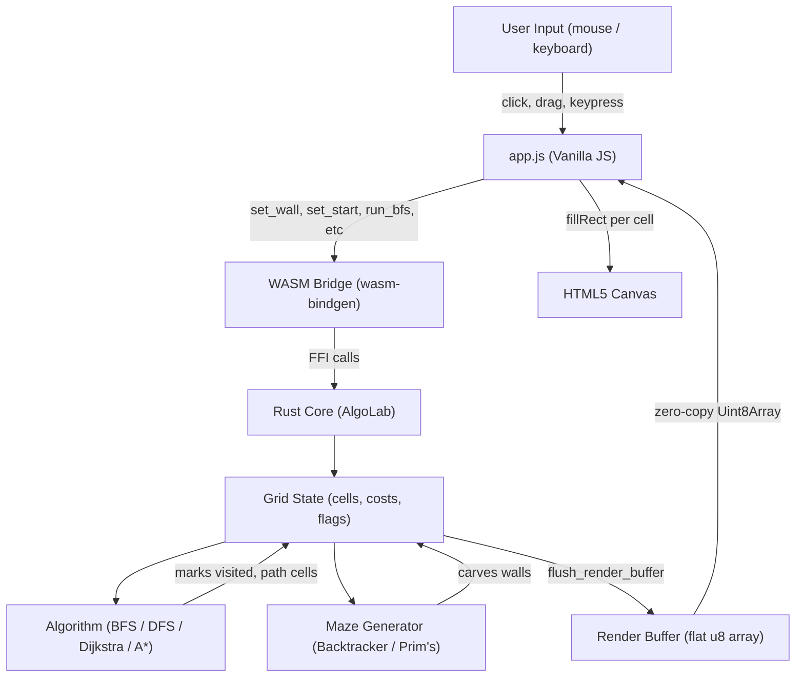

# Rust WASM Algorithm Lab

A high-performance pathfinding and maze generation visualizer built with Rust and WebAssembly. The algorithm engine is written in Rust and compiled to WASM, while a vanilla JS frontend handles rendering via HTML5 Canvas.

---

## Live Demo

[GitHub Pages link here]

---

## Features

- Pathfinding algorithms: BFS, DFS, Dijkstra, A*
- Maze generation: Recursive Backtracker, Prim's
- Weighted terrain: Mud (cost 3), Water (cost 5)
- Draw walls by clicking and dragging
- Stats sidebar: nodes explored, path length, execution time
- Keyboard shortcut: R to reset

---

## Stack

- Language: Rust 1.80+
- WASM bridge: wasm-pack, wasm-bindgen
- Frontend: Vanilla JS, HTML5 Canvas
- Build: wasm-pack --target web
- Deploy: GitHub Actions to GitHub Pages

---

## Information Flow



---

## Project Structure

```
rust-wasm-algo-lab/
├── src/
│   ├── lib.rs                        # WASM entry point, AlgoLab facade
│   ├── grid.rs                       # Grid and Cell structs, render buffer
│   ├── stats.rs                      # Stats returned by algorithms
│   ├── algorithms/
│   │   ├── mod.rs                    # Shared reconstruct_path utility
│   │   ├── bfs.rs
│   │   ├── dfs.rs
│   │   ├── dijkstra.rs
│   │   └── astar.rs
│   └── maze/
│       ├── mod.rs
│       ├── recursive_backtracker.rs
│       └── prims.rs
├── web/
│   ├── app.js                        # All frontend logic, single file
│   └── style.css
├── pkg/                              # wasm-pack output (gitignored)
├── index.html
├── Cargo.toml
└── .github/
    └── workflows/
        └── deploy.yml                # CI/CD to GitHub Pages
```

---

## Build Locally

Prerequisites: Rust, wasm-pack, Python (for local serving)

```bash
# Install wasm-pack
cargo install wasm-pack

# Build
wasm-pack build --target web

# Serve
python -m http.server 8080
```

Open `http://127.0.0.1:8080`.

---

## Lessons Learned

### wasm-bindgen cannot expose references to custom structs
If a method on a `#[wasm_bindgen]` struct returns `Option<&MyStruct>` or `Option<&mut MyStruct>`, the compiler will throw `WasmDescribe` trait errors. The fix is to split the impl block into two: one with `#[wasm_bindgen]` for JS-facing methods that only use primitive types, and one plain impl for internal Rust methods that can return references freely.

### Trunk on Windows has a MIME type bug with ES modules
Trunk intercepts all HTTP requests and returns `index.html` for unknown paths, which causes browsers to reject JS files loaded as ES modules because the MIME type is `text/html`. The fix is to avoid Trunk for serving entirely and use `wasm-pack` with a hand-written `index.html` and Python's built-in server for local development, and GitHub Pages for production.

### ES module imports do not mix with plain script tags
When a WASM module is loaded as an ES module and a separate plain script needs access to its exports, the two contexts do not share scope. The clean solution is to assign WASM exports to `window` properties after init and load the plain script dynamically via `script.onload`, ensuring the WASM is ready before the app script executes.

### Shared utilities belong in mod.rs
If the same function appears identically in multiple sibling modules, move it to the parent `mod.rs` and import via `super::`. This project had `reconstruct_path` duplicated across four algorithm files and `carve`/`maze_neighbors`/`random_index` duplicated across two maze files. Duplication means any bug fix must be applied N times.

### Rust module folders require an explicit mod.rs
Every folder under `src/` that acts as a module must have a `mod.rs` file declaring its submodules. Forgetting this produces an `E0583: file not found for module` error that is easy to confuse with a path issue.

### Zero-copy rendering via shared memory buffer
Rather than passing cell state through JS function calls on every frame, Rust maintains a flat `u8` render buffer that JS reads directly via `new Uint8Array(wasm.memory.buffer, ptr, len)`. This is zero-copy — no serialization, no allocation on the JS side. The encoding contract is a single function `to_render_byte()` in Rust matched by a `CELL_COLORS` map in JS.

### wasm-pack produces stable filenames, Trunk does not
Trunk hashes its output filenames on every build, which breaks hardcoded import paths. `wasm-pack --target web` always outputs `pkg/rust_wasm_algo_lab.js` with no hash, making imports predictable and CI/CD straightforward.

### A* vs Dijkstra
Both find the optimal path in a weighted grid. The difference is A* adds a heuristic (Manhattan distance to the goal) to the priority, biasing exploration toward the destination. On open grids A* explores dramatically fewer nodes. Manhattan is admissible for 4-directional movement because it never overestimates the true cost.

### Maze generation requires 2-step neighbor traversal
When carving mazes from a fully walled grid, neighbors must be 2 cells away, not 1. This ensures the wall between the current cell and the chosen neighbor is always carved correctly. Using 1-step neighbors destroys the wall structure and produces an open field.